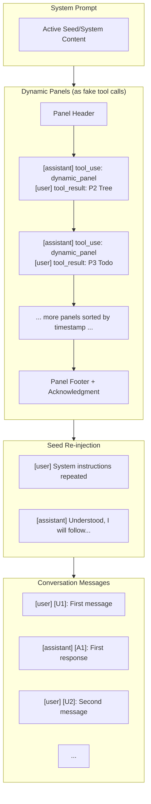
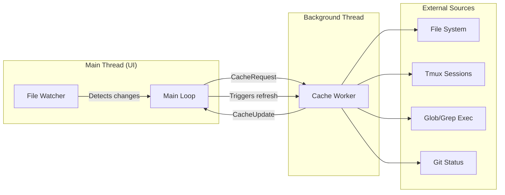

# Context Pilot
<!-- tracking branch for #5 -->

**WIP: token counting**

A terminal-based AI coding assistant built in Rust that provides an interactive interface for AI-assisted development with full project context awareness.


## Features

### 🤖 AI-Powered Assistance
- **Multi-LLM Support** - Anthropic Claude, Grok (xAI), Groq, and Claude Code (OAuth)
- **Context-Aware** - Automatically includes relevant project files, directory structure, and more
- **Tool Execution** - AI can directly interact with your codebase through 37+ built-in tools

### 📁 Smart Context Management
- **File Context** - Open files and keep them in context for reference
- **Directory Tree** - Filtered view of your project structure (gitignore-style filtering)
- **Glob Search** - Create persistent file searches that update automatically
- **Grep Search** - Search file contents with regex patterns
- **Tmux Integration** - Create terminal panes, run commands, capture output
- **Todo Lists** - Hierarchical task management with status tracking
- **Memory System** - Persistent notes with importance levels

### Non-Blocking Architecture
- **Background Caching** - All file I/O, searches, and terminal captures run in background threads
- **File Watching** - Automatic cache invalidation when files change (using inotify)
- **Timer-Based Refresh** - Glob/grep results refresh every 30s, tmux every 1s
- **Instant UI** - Main thread never blocks on I/O operations

### 💬 Conversation Features
- **Message Summarization** - Automatic TL;DR generation for long messages
- **Context Control** - Mark messages as full, summarized, or forgotten
- **Token Tracking** - Visual token usage with 100K limit indicator
- **Persistent History** - Conversations saved and restored across sessions

### 🎨 Terminal UI
- **Modern Design** - Clean interface with warm color theme
- **Syntax Highlighting** - Code files displayed with proper highlighting
- **Mouse Support** - Click to select, scroll to navigate
- **Copy Mode** - Toggle mouse capture for text selection
- **Responsive Layout** - Adapts to terminal size

## Installation

### Prerequisites
- Rust 1.75 or later
- An Anthropic API key

### Build from Source

```bash
git clone https://github.com/yourusername/context-pilot.git
cd context-pilot
cargo build --release
```

### Configuration

Create a `.env` file in the project root:

```env
ANTHROPIC_API_KEY=your_api_key_here
```

## Usage

```bash
cargo run --release
```

### Keyboard Shortcuts

| Shortcut | Action |
|----------|--------|
| `Shift+Enter` or `Alt+Enter` | Send message |
| `Tab` / `Shift+Tab` | Next / Previous panel |
| `Up/Down` | Scroll panel content |
| `PageUp/PageDown` | Fast scroll |
| `Ctrl+L` | Clear conversation |
| `Ctrl+H` | Open configuration overlay |
| `Ctrl+P` | Open command palette |
| `Ctrl+N` | New context |
| `Ctrl+Q` | Quit |
| `Esc` | Stop streaming |
| `F12` | Toggle performance monitor |
| `p1`, `p2`, etc. | Quick switch to panel |

### Context Panel Navigation

- Use `Tab` / `Shift+Tab` to cycle through panels
- Type `p1`, `p2`, `p3`, etc. in the input and press Enter/Space to jump to a specific panel
- Use `Ctrl+P` to open command palette and search for panels

## Available Tools

The AI assistant can use these tools to interact with your project:

### File Tools
| Tool | Description |
|------|-------------|
| `file_open` | Open a file and add it to context |
| `file_create` | Create a new file |
| `file_edit` | Edit an existing file with search/replace |
| `file_batch_create` | Create multiple files and folders at once |
| `file_glob` | Search for files matching a glob pattern |
| `file_grep` | Search file contents with regex |

### Tree Tools
| Tool | Description |
|------|-------------|
| `tree_filter` | Edit gitignore-style directory filter |
| `tree_toggle` | Open/close folders in directory tree |
| `tree_describe` | Add descriptions to files/folders |

### Context Tools
| Tool | Description |
|------|-------------|
| `context_close` | Remove context elements |
| `context_message_status` | Set message status (full/summarized/deleted) |

### Console Tools
| Tool | Description |
|------|-------------|
| `console_create` | Create a tmux pane for terminal output |
| `console_edit` | Configure tmux pane settings |
| `console_send_keys` | Send commands to a tmux pane |
| `console_sleep` | Wait for command output |

### Todo Tools
| Tool | Description |
|------|-------------|
| `todo_create` | Create todo items |
| `todo_update` | Update or delete todo items |

### Memory Tools
| Tool | Description |
|------|-------------|
| `memory_create` | Create persistent memory items |
| `memory_update` | Update or delete memory items |

### System Prompt Tools
| Tool | Description |
|------|-------------|
| `system_create` | Create a new system prompt (seed) |
| `system_edit` | Edit an existing system prompt |
| `system_delete` | Delete a system prompt |
| `system_load` | Activate a system prompt |
| `system_reload` | Reload the TUI application |

### Git Tools
| Tool | Description |
|------|-------------|
| `git_toggle_details` | Show/hide diff content in git panel |
| `git_toggle_logs` | Show/hide commit history |
| `git_commit` | Stage files and commit |
| `git_branch_create` | Create and switch to new branch |
| `git_branch_switch` | Switch to another branch |
| `git_merge` | Merge a branch into current |
| `git_pull` | Pull from remote |
| `git_push` | Push to remote |
| `git_fetch` | Fetch from remote |

### Scratchpad Tools
| Tool | Description |
|------|-------------|
| `scratchpad_create_cell` | Create a scratchpad cell for notes |
| `scratchpad_edit_cell` | Edit a scratchpad cell |
| `scratchpad_wipe` | Delete scratchpad cells |

### Meta Tools
| Tool | Description |
|------|-------------|
| `tool_manage` | Enable/disable tools |

## API Request Structure

This section documents how the prompt sent to the LLM is constructed.

### Message Flow Overview



### Panel Injection (Dynamic Context)

Panels (P2-P7+) are injected as fake `tool_use`/`tool_result` pairs before the conversation. This allows the LLM to see project context as if it had called tools itself.

**Panel Order**: Sorted by `last_refresh_ms` ascending (oldest first, newest closest to conversation).

**Panel Format**:
```
======= [P2] Directory Tree =======
{tree content}
```

**Panels Excluded**: P0 (System/Seed) and P1 (Conversation) are not injected as panels.

### Message ID Format

All messages include visible IDs for the LLM to reference:

| Role | ID Format | Example |
|------|-----------|---------|
| User message | `[U{n}]:` | `[U1]:\nHello!` |
| Assistant response | `[A{n}]:` | `[A1]:\nHi there!` |
| Tool result | `[R{n}]:` | `[R1]:\nFile opened` |

**Note**: Tool call messages (T-blocks) don't have visible IDs due to API constraints - `tool_use` blocks cannot contain mixed text.

### Summarized Messages

When a message has `status == Summarized`:
- Uses the `tl_dr` field instead of full `content`
- Same ID format: `[A5]:\n{tl_dr text}`
- Reduces token usage while preserving context

### Tool Execution Flow

1. Assistant message includes `tool_use` blocks
2. Tools execute locally, results collected
3. Tool results sent as `tool_result` blocks in user message
4. Assistant continues with access to results
5. Process repeats if more tools are called

## Architecture

### Panel Caching System

The application uses a non-blocking caching architecture to ensure the UI remains responsive:



**Cache Invalidation Strategies:**

| Context Type | Invalidation Method |
|--------------|---------------------|
| File | File watcher (inotify) detects changes |
| Tree | Directory watcher on open folders |
| Glob | Timer-based (30 second refresh) |
| Grep | Timer-based (30 second refresh) |
| Tmux | Timer-based (1 second) + hash of last 2 lines |
| Conversation | Internal state changes |
| Todo/Memory | Internal state changes |

**Key Properties:**
- Same cached content used for both UI rendering and LLM context
- Background threads handle all blocking I/O
- Main thread only reads from cache, never blocks
- File watchers only monitor actively open files/folders

## Dependencies

- **ratatui** - Terminal UI framework
- **crossterm** - Cross-platform terminal manipulation
- **reqwest** - HTTP client for API calls
- **serde/serde_json/serde_yaml** - Serialization
- **syntect** - Syntax highlighting
- **ignore** - Gitignore-style file filtering
- **globset** - Glob pattern matching
- **notify** - File system notifications (inotify on Linux)

## Contributing

Contributions are welcome! Please read our [Contributing Guide](CONTRIBUTING.md) before submitting a PR.

### Quick Start

1. Fork the repository
2. Create a feature branch (`git checkout -b feature/amazing-feature`)
3. Make your changes
4. Run tests (`cargo build --release && cargo test`)
5. Commit (`git commit -m 'feat: add amazing feature'`)
6. Push (`git push origin feature/amazing-feature`)
7. Open a Pull Request

### Code Owners

We use [CODEOWNERS](/.github/CODEOWNERS) for automatic reviewer assignment. See the [Contributing Guide](CONTRIBUTING.md#code-owners) for team details.

By contributing, you agree that your contributions will be licensed under the AGPL-3.0 license.

## License

This project is dual-licensed:

- **Open source** — available under the [GNU Affero General Public License v3.0 (AGPL-3.0)](LICENSE). You are free to use, modify, and distribute this software under the terms of the AGPL, which requires that any modified versions or derivative works (including use over a network) also be released under the AGPL with full source code.

- **Commercial** — if you wish to use this software in a proprietary or closed-source product without the AGPL copyleft obligations, a commercial license is available. Please contact **[your email or link]** for pricing and terms.

### Why dual licensing?

If you're building an open-source project or are comfortable sharing your source code, the AGPL-3.0 license is free and imposes no cost. If you need to keep your code proprietary, the commercial license lets you do that while supporting the continued development of this project.

---

Built with ❤️ and Rust