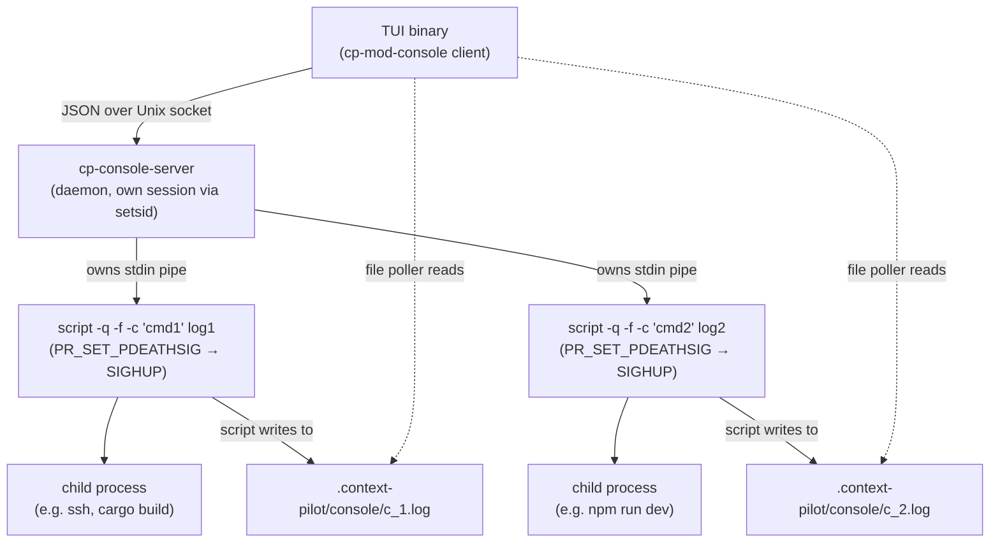
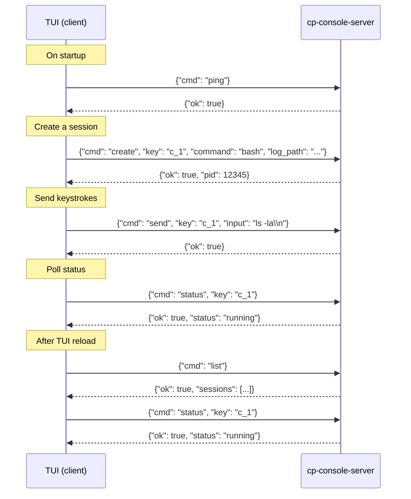
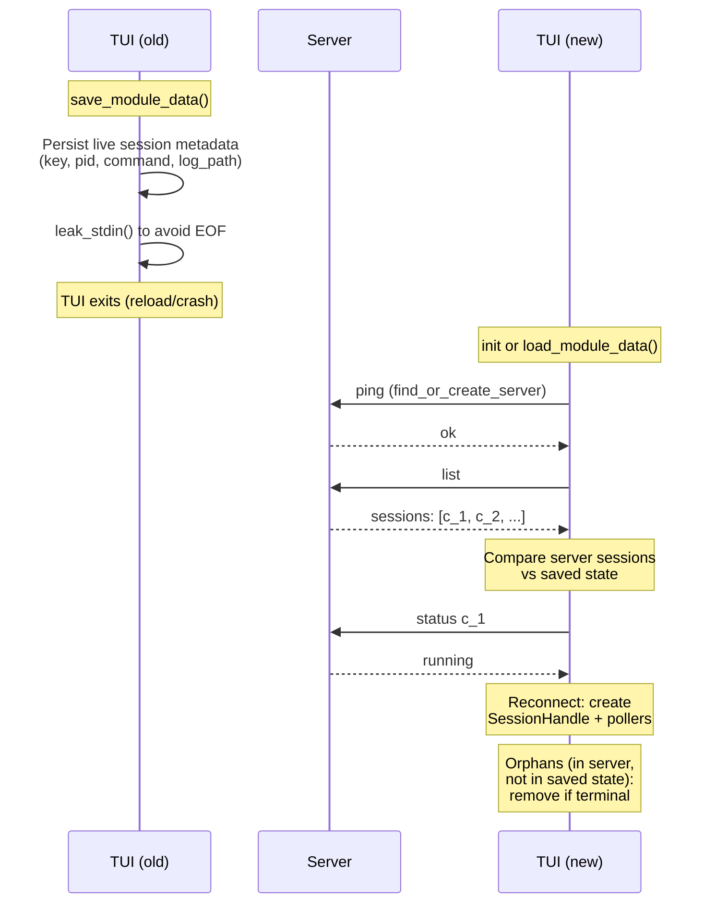

# Console Server Architecture

The console module uses a **client-server architecture** to persist child processes across TUI reloads. The server (`cp-console-server`) is a standalone daemon that owns the actual processes. The TUI (client) communicates with it over a Unix domain socket using JSON-line protocol.

## Why a separate server?

When the TUI reloads (hot-reload, crash recovery, `reload_tui`), its process exits. Any child processes it owned directly would receive SIGHUP and die. The server solves this by outliving the TUI — it holds the `script` process handles and stdin pipes, so sessions survive TUI restarts.

## Process hierarchy



Key points:
- The server calls `setsid()` so it is not a child of the TUI.
- Each `script` process uses `prctl(PR_SET_PDEATHSIG, SIGHUP)` so it receives SIGHUP when the server dies. This cascades: server dies → script gets SIGHUP → script dies → PTY master closes → child process gets terminal hangup → child dies.
- Output capture: `script -q -f` writes all PTY output to a log file. The TUI polls that file into a `RingBuffer` for display.
- Input: the server holds each session's `ChildStdin`. The TUI sends keystrokes via the `send` command, and the server writes them to stdin.

## Communication protocol



### Commands

| Command    | Fields                                      | Description                                          |
|------------|---------------------------------------------|------------------------------------------------------|
| `ping`     |                                             | Health check. Returns `{"ok": true}`.                |
| `create`   | `key`, `command`, `log_path`, `cwd?`        | Spawn a `script` process. Returns `pid`.             |
| `send`     | `key`, `input`                              | Write bytes to session stdin (escape sequences interpreted). |
| `kill`     | `key`, `force?`                             | SIGTERM then SIGKILL the `script` process.           |
| `remove`   | `key`, `force?`                             | Kill (if running) + remove session from server map.  |
| `status`   | `key`                                       | Poll and return session status + exit code.          |
| `list`     |                                             | Return all sessions with status.                     |
| `shutdown` |                                             | Kill all sessions and exit the server process.       |

## TUI reload lifecycle



## File layout

```
.context-pilot/console/
  server.sock          # Unix domain socket
  server.pid           # Server PID (for manual kill)
  c_1.log              # Output log for session c_1
  c_2.log              # Output log for session c_2
```

## Rebuilding & restarting the server

The server is a long-lived daemon. Unlike the TUI binary which picks up changes on relaunch, **the server keeps running the old binary until explicitly killed**. After changing code in `crates/cp-mod-console/src/server/main.rs`:

```sh
# 1. Build
cargo build --release -p cp-mod-console

# 2. Kill the running server
kill $(cat .context-pilot/console/server.pid)

# 3. Clean stale socket/pid (the old process held the socket)
rm -f .context-pilot/console/server.sock .context-pilot/console/server.pid

# 4. Relaunch TUI — find_or_create_server() spawns the new binary automatically
```

If you need to restart without relaunching the TUI, you can also send the shutdown command directly:

```sh
echo '{"cmd":"shutdown"}' | socat - UNIX-CONNECT:.context-pilot/console/server.sock
rm -f .context-pilot/console/server.sock .context-pilot/console/server.pid
```

The TUI's next `server_request()` call will fail, triggering `find_or_create_server()` which spawns the new binary.

### Binary resolution order

The client (`manager.rs:server_binary_path()`) looks for `cp-console-server` in:

1. **Next to the TUI binary** — deployed/installed scenario
2. **`target/release/`** — `cargo run --release`
3. **`target/debug/`** — `cargo run`

So `cargo build --release -p cp-mod-console` puts the binary where `cargo run --release` will find it. For debug builds, use `cargo build -p cp-mod-console`.

### Process cleanup on server death

Each `script` child is spawned with `prctl(PR_SET_PDEATHSIG, SIGHUP)`, so killing the server automatically sends SIGHUP to all `script` processes. When `script` dies, its PTY master closes, which delivers a terminal hangup to the child shell — so the entire tree is cleaned up. No orphaned processes.
